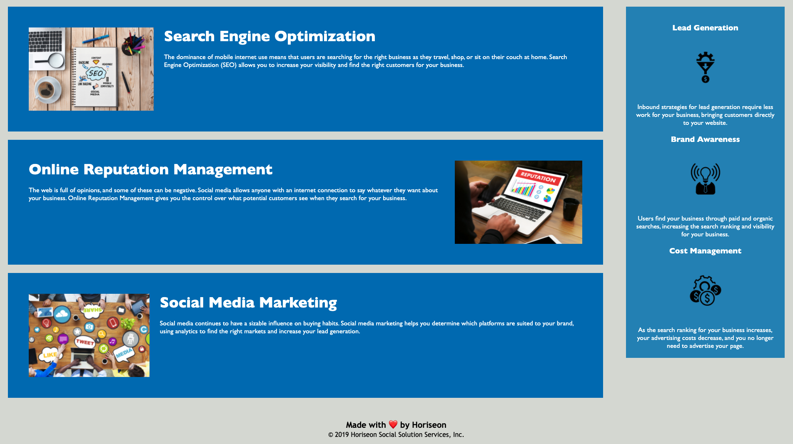

# Horiseon Accessibility Project
> Horiseon Marketing Co has requested thier current website be refactored to improve it's SEO and increase user accessibility.
> Live demo [_here_](https://3lydaley.github.io/horiseon-acc-project/). <!-- If you have the project hosted somewhere, include the link here. -->

## Table of Contents
* [General Info](#general-information)
* [Technologies Used](#technologies-used)
* [Features](#features)
* [Screenshots](#screenshots)
* [Project Status](#project-status)
* [Room for Improvement](#room-for-improvement)
* [Acknowledgements](#acknowledgements)
* [Contact](#contact)
<!-- * [License](#license) -->

## General Information
- Clients Horiseon requested an improvement in accessibility in the page's HTML, optimizing SEO representation and user acessibility. 
- This project replaced the non-descriptive 
 elements and replaced with semantic HTML to assist with browser accessibility and further organizing the HTML for future developers. 
- The refactored code is now more efficiently labeled, using descriptive semantics and developer comments throughout the code. All images appeared to be non-essential decorative images, so they were given empty alt tags to assist the screenreader's efficiency as well. The CSS stylesheet has been re-arranged and re-titled, and the website's sections are now all consistent with the layout of the webpage, complete with comments indicating the functions of each section. 
<!-- You don't have to answer all the questions - just the ones relevant to your project. -->

## Technologies Used
- Tech 1 - VS Code
- Tech 2 - version 2.0
- Tech 3 - version 3.0

## Features
List the ready features here:
- Functioning Navigation links
- Streamlined stylesheet 
- Updated accessible HTML

## Screenshots

<!-- If you have screenshots you'd like to share, include them here. -->

## Project Status
Project is: _in review_ 

## Room for Improvement

Room for improvement:
- Adding pages to the site to allow for further elaboration of modules.
- More interactive elements for users to explore the background of the company and what they offer their users. 

## Acknowledgements
Give credit here.
- This project was inspired by [this prompt](https://ucb.bootcampcontent.com/UCB-Coding-Bootcamp/UCB-VIRT-BO-FSF-PT-03-2022-U-B/-/tree/main/01-HTML-Git-CSS/02-Challenge).
- This project was based on [this tutorial](https://www.example.com).
- Many thanks to W3 School's tutorials on [HTML accessiblity](https://www.w3schools.com/html/html_accessibility.asp) and the basics of HTML and CSS. 

## Contact
Created by [@3lydaley](https://github.com/3lyDaley) - feel free to contact me!

<!-- Optional -->
<!-- ## License -->
<!-- This project is open source and available under the [... License](). -->

<!-- You don't have to include all sections - just the one's relevant to your project -->